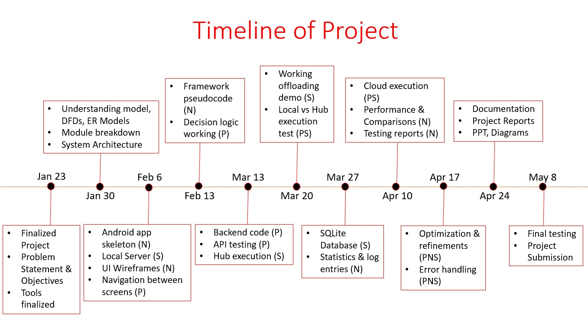

# OffloadX

OffloadX is an Android application that offloads computationally intensive tasks to a remote Python backend. This approach allows the mobile device to save battery and reduce processing time by leveraging the CPU power of a server or local laptop.

**Technical Workflow**
The application follows a specific logic flow to handle tasks:
1.  **Input Analysis:** The app checks the file size of the input (e.g., image or dataset).
2.  **Decision Logic:**
    *   If the input is small, the task runs locally on the Android device.
    *   If the input exceeds a defined size threshold, the app switches to offloading mode.
3.  **Data Transmission:** The app sends the data payload via a REST API (HTTP POST) to the Python backend.
4.  **Remote Processing:** The backend (Flask/FastAPI) receives the data, processes it (e.g., image filtering or matrix multiplication), and sends back the result.
5.  **Latency Tracking:** The app records timestamps for 'Send', 'Process', and 'Receive' events to calculate total execution time and compare it with local processing.

**Project Components**
- **Android Client:** Native Android application (Java/Kotlin) handling UI and logic.
- **Python Backend:** A lightweight compute server, deployable on any local machine or cloud environment.
- **SQLite Database:** Embedded in the Android app to store performance logs and history.
- **Encryption:** Basic data encryption applied before transmission over the network.

**Supported Modes**
- **Local:** On-device processing.
- **Remote Offloading:** Seamless task execution on a connected server or local compute node.
- **Network Share:** Secure P2P-style data sharing between authorized devices.

**Project Timeline**
